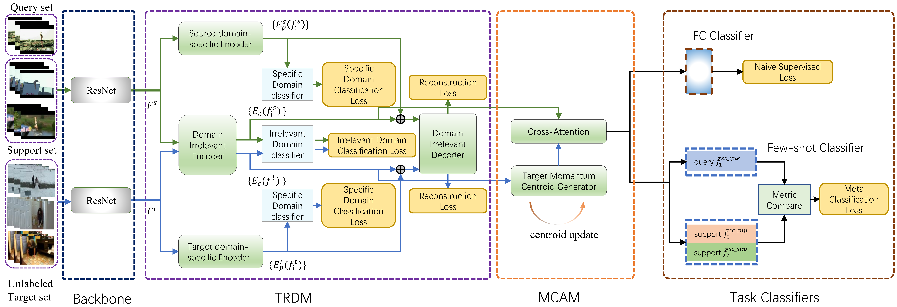

# Momentum Centroid Alignment with Temporal-Relational Disentanglement for Cross-Domain Few-Shot Action Recognition (TRD-MCA)
## Frame work of the paper

## Splits
We used https://github.com/ffmpbgrnn/CMN for Kinetics and SSv2, which are provided by the authors of the authors of [CMN](https://openaccess.thecvf.com/content_ECCV_2018/papers/Linchao_Zhu_Compound_Memory_Networks_ECCV_2018_paper.pdf)(Zhu and Yang, ECCV 2018). 
We also used the split from [OTAM](https://openaccess.thecvf.com/content_CVPR_2020/papers/Cao_Few-Shot_Video_Classification_via_Temporal_Alignment_CVPR_2020_paper.pdf) (Cao et al. CVPR 2020) for SSv2, 
and splits from [ARN](https://www.ecva.net/papers/eccv_2020/papers_ECCV/papers/123500511.pdf) (Zhang et al. ECCV 2020) for HMDB and UCF.  These are all the in the splits folder.

For Diving48 and RareAct dataset, we use the split from [CDFSL-V](https://openaccess.thecvf.com/content/ICCV2023/papers/Samarasinghe_CDFSL-V_Cross-Domain_Few-Shot_Learning_for_Videos_ICCV_2023_paper.pdf).
The code is from [here](https://github.com/Sarinda251/CDFSL-V)

### 
If you want to reproduce the results, 
please download the video according to the video ID in the split.
