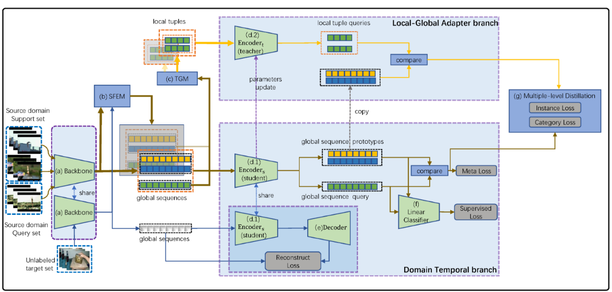
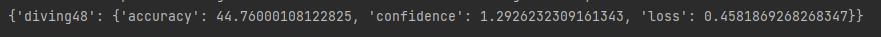
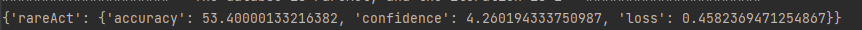
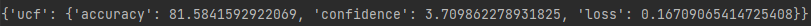
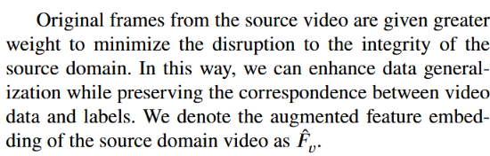
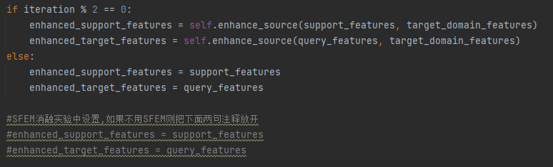

# Global Sequences and Local Tuples Alignment for Cross-Domain Few-Shot Action Recognition (GSLTA-CDFSAR)
## Frame work of the paper

This paper has been accepted by Knowledge Based Systems.(https://10.1016/j.knosys.2025.113041)
This repo contains code for the method introduced in the paper: (https://github.com/cofly2014/GSLTA)

## Splits
We used https://github.com/ffmpbgrnn/CMN for Kinetics and SSv2, which are provided by the authors of the authors of [CMN](https://openaccess.thecvf.com/content_ECCV_2018/papers/Linchao_Zhu_Compound_Memory_Networks_ECCV_2018_paper.pdf)(Zhu and Yang, ECCV 2018). 
We also used the split from [OTAM](https://openaccess.thecvf.com/content_CVPR_2020/papers/Cao_Few-Shot_Video_Classification_via_Temporal_Alignment_CVPR_2020_paper.pdf) (Cao et al. CVPR 2020) for SSv2, 
and splits from [ARN](https://www.ecva.net/papers/eccv_2020/papers_ECCV/papers/123500511.pdf) (Zhang et al. ECCV 2020) for HMDB and UCF.  These are all the in the splits folder.

For Diving48 and RareAct dataset, we use the split from [CDFSL-V](https://openaccess.thecvf.com/content/ICCV2023/papers/Samarasinghe_CDFSL-V_Cross-Domain_Few-Shot_Learning_for_Videos_ICCV_2023_paper.pdf).
The code is from [here](https://github.com/Sarinda251/CDFSL-V)

## Config
### 1.  hyper-parematers of the models

lambdas = [1, 1, 0.1, 0.05, 0.05]

task_loss_total = lambdas[0] * superviesed_class_loss + lambdas[1] * meta_target_loss + lambdas[2] * reconstruct_distance_loss + lambdas[3] * self_loss + lambdas[4] * cross_loss

Please note that our hyperparameter tuning may not be optimal.

### 2.  other config
|                    name | we use                               |                     means                     | 
|------------------------:|:-------------------------------------|:---------------------------------------------:|
|                 seq_len | 8                                    |            Frame number per video             |
|             sub_seq_len | 4                                    |         Frame number of  subsequence          | 
|             sub_seq_num | 10                                   | the number of subsequence of a full sequence  | 
|               class_num | according to  the source domain  |   Category number of the source domain    |

## The trained models and results of GSLTA.
This table is a reproduction. There are slight deviations between the data results and those published in the article, with the precision being either higher or lower. 
It may be updated in the future.

We use the Kinetics as the source Domain

| target domain | accuracy | model                                                                       |
|--------------:|:--------:|-----------------------------------------------------------------------------|
|      diving48 |  44.76%  | near 14500 episode https://pan.baidu.com/s/1OE8roh8sgH0nDlVpVuTwYQ?pwd=4tnh |
|       rareAct |  53.4%   | near 12000 episode https://pan.baidu.com/s/1sRX5AZZm-VhyvwzWkqPWdA?pwd=5xrr |
|          SSv2 |   32%    | please wait...                                                              |
|        HMDB51 |  54.06%  | near 13500 episode https://pan.baidu.com/s/1Y4ST8Raa0PGZ_vgwvqYSHg?pwd=hbdv |
|        UCF101 |  81.6%   | near 20000 episode https://pan.baidu.com/s/1IvdoxSl3W_BUAIir8MRTag?pwd=pixe |

 

## Acknowledgements
We took inspiration from the [Revisiting Prototypical Network for Cross Domain Few-Shot Learning](https://openaccess.thecvf.com/content/CVPR2023/papers/Zhou_Revisiting_Prototypical_Network_for_Cross_Domain_Few-Shot_Learning_CVPR_2023_paper.pdf) 
and [Deep Reconstruction-Classification Networks for Unsupervised Domain Adaptation](https://link.springer.com/chapter/10.1007/978-3-319-46493-0_36)

## Please Note
### (1)

In our code, we compute the self_loss_l2g, self_loss_g2l, also the cross_loss_l2g and self_loss_g2l,
But we just the self_loss_l2g and cross_loss_l2g, this is consistent with our paper.

### (2)

is mapping to the code  

### (3)
If you want to reproduce the results, 
please download the video according to the video ID in the split.
